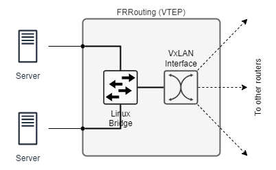

# VxLAN Labs

This repository includes multiple lab setups that illustrate multiple ways to deploy VxLANs:

- Point-to-Point Tunnel
- Flooding
- Multicast
- BGP-EVPN

## Usage

Clone this repository:

```
$ git clone https://github.com/martimy/clab_vxlan_frr [vxlan]
```

Change to the directory of the lab you choose. For example

```
$ cd clab_vxlan_frr
$ cd ptp
```

For more information, read the lab the documentation.

## Introduction to VxLAN

Virtual eXtensible Local-Area Network (VxLAN) is a standard network virtualization technology defined by the Internet Engineering Task Force (IETF) in [RFC 7348](https://datatracker.ietf.org/doc/html/rfc7348). It carries Ethernet traffic over an existing IP network from, potentially, a large number of tenants while maintaining traffic separation.

VXLANs are encapsulated within UDP packets. The physical layout and geographic distance between nodes in the underlying network are irrelevant as long as UDP datagrams are forwarded between VXLAN Tunnel Endpoint (VTEP) devices.

VXLANs expand the Layer 2 network address space significantly, from 4K to 16 million. Each VXLAN network identifier (VNI) uniquely identifies a Layer 2 subnet or segment, enabling communication between virtual machines within the same VNI without requiring routing, while communication across different VNIs requires a router.


VTEPs are responsible for encapsulating and decapsulating Ethernet frames into VXLAN packets. When a VM sends a packet to another VM within the same VXLAN segment but on a different host, the packet is encapsulated with a VXLAN header by the source VTEP. This header includes information such as the VXLAN Network Identifier (VNI) and the destination VTEP's IP address. When a VXLAN packet arrives at the destination VTEP, it is decapsulated to reveal the original Ethernet frame, which is then forwarded to the destination VM.

The following diagram describes the structure of VTEP in Linux:



### VTEP Discovery

VXLAN does not provide a control plane, and VTEP discovery and host information (IP and MAC addresses, VNIs, and gateway VTEP IP address) learning are implemented using several [strategies](https://vincent.bernat.ch/en/blog/2017-vxlan-linux), including:

- Unicast with static flooding
- Unicast with static L2/L3 entries
- Multicast
- EVPN

The latter strategy uses EVPN as the control plane. EVPN allows VTEPs to exchange BGP EVPN routes to implement automatic VTEP discovery and host information advertisement, preventing unnecessary traffic flooding.


## Notes

- This lab uses Dokcer image: quay.io/frrouting/frr:9.1.0
  - FRR version: 9.1.0 running on Alpine Linux with Linux kernel 5.4.0-91-generic x86_64
