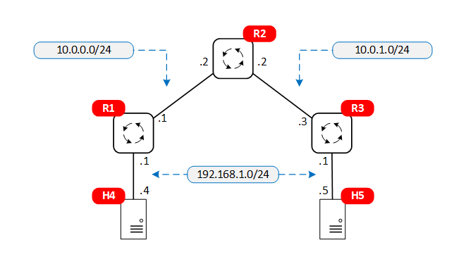

# VxLAN Lab

This lab demonstrates the use of VxLAN to create an Ethernet tunnel connecting two LAN segments across a layer 3 network using BGP EVPN technology.



## Starting and ending the lab

Use the following command to start the lab:

```
$ sudo clab deploy -t vxlan-frr-simple.clab.yml
```

Setup VxLAN:

```
$ sudo ./setup-vxlan.sh
```

To end the lab:

```
sudo clab destroy --t vxlan-frr-simple.clab.yml
```


## Try This

In one terminal, ping from one host to the other:

```
$ docker exec -it clab-vxlan_frr_simple-host4 ping 192.168.1.5
```

In another terminal, use tshark to look at the traffic at R3:

```
$ sudo ip netns exec clab-vxlan_frr_simple-r3 tshark -i eth2 -O vxlan
```

You should see output similar to the following. Note the encapsulation of Ethernet frame inside a UDP packet coming from R1.

```
Frame 24: 148 bytes on wire (1184 bits), 148 bytes captured (1184 bits) on interface eth2, id 0
Ethernet II, Src: aa:c1:ab:45:3f:fd (aa:c1:ab:45:3f:fd), Dst: aa:c1:ab:0d:f7:60 (aa:c1:ab:0d:f7:60)
Internet Protocol Version 4, Src: 10.0.0.1, Dst: 10.0.1.3
User Datagram Protocol, Src Port: 48069, Dst Port: 4789
Virtual eXtensible Local Area Network
    Flags: 0x0800, VXLAN Network ID (VNI)
        0... .... .... .... = GBP Extension: Not defined
        .... .... .0.. .... = Don't Learn: False
        .... 1... .... .... = VXLAN Network ID (VNI): True
        .... .... .... 0... = Policy Applied: False
        .000 .000 0.00 .000 = Reserved(R): 0x0000
    Group Policy ID: 0
    VXLAN Network Identifier (VNI): 10
    Reserved: 0
Ethernet II, Src: aa:c1:ab:89:e4:66 (aa:c1:ab:89:e4:66), Dst: aa:c1:ab:78:a6:40 (aa:c1:ab:78:a6:40)
Internet Protocol Version 4, Src: 192.168.1.4, Dst: 192.168.1.5
Internet Control Message Protocol
```

Or at router R1:

```
$ sudo ip netns exec clab-vxlan_frr_simple-r1 tshark -i eth1 -O vxlan
```

with an output similar to the following:

```
Frame 18: 148 bytes on wire (1184 bits), 148 bytes captured (1184 bits) on interface eth1, id 0
Ethernet II, Src: aa:c1:ab:b0:e5:6d (aa:c1:ab:b0:e5:6d), Dst: aa:c1:ab:a3:9c:4e (aa:c1:ab:a3:9c:4e)
Internet Protocol Version 4, Src: 10.0.1.3, Dst: 10.0.0.1
User Datagram Protocol, Src Port: 35198, Dst Port: 4789
Virtual eXtensible Local Area Network
    Flags: 0x0800, VXLAN Network ID (VNI)
        0... .... .... .... = GBP Extension: Not defined
        .... .... .0.. .... = Don't Learn: False
        .... 1... .... .... = VXLAN Network ID (VNI): True
        .... .... .... 0... = Policy Applied: False
        .000 .000 0.00 .000 = Reserved(R): 0x0000
    Group Policy ID: 0
    VXLAN Network Identifier (VNI): 10
    Reserved: 0
Ethernet II, Src: aa:c1:ab:03:3d:85 (aa:c1:ab:03:3d:85), Dst: aa:c1:ab:62:59:72 (aa:c1:ab:62:59:72)
Internet Protocol Version 4, Src: 192.168.1.5, Dst: 192.168.1.4
Internet Control Message Protocol
```

To verify EVPN configuration on the router R1:

```
$ docker exec -it clab-vxlan_frr_simple-r1 vtysh -c "show bgp l2vpn evpn"
```

```
BGP table version is 2, local router ID is 1.1.1.1
Status codes: s suppressed, d damped, h history, * valid, > best, i - internal
Origin codes: i - IGP, e - EGP, ? - incomplete
EVPN type-1 prefix: [1]:[EthTag]:[ESI]:[IPlen]:[VTEP-IP]
EVPN type-2 prefix: [2]:[EthTag]:[MAClen]:[MAC]:[IPlen]:[IP]
EVPN type-3 prefix: [3]:[EthTag]:[IPlen]:[OrigIP]
EVPN type-4 prefix: [4]:[ESI]:[IPlen]:[OrigIP]
EVPN type-5 prefix: [5]:[EthTag]:[IPlen]:[IP]

   Network          Next Hop            Metric LocPrf Weight Path
Route Distinguisher: 1.1.1.1:2
*> [2]:[0]:[48]:[aa:c1:ab:76:73:f4]
                    1.1.1.1                            32768 i
                    ET:8 RT:100:10
*> [3]:[0]:[32]:[1.1.1.1]
                    1.1.1.1                            32768 i
                    ET:8 RT:100:10
Route Distinguisher: 3.3.3.3:2
*>i[2]:[0]:[48]:[aa:c1:ab:73:dd:cb]
                    3.3.3.3                  0    100      0 i
                    RT:100:10 ET:8
*>i[3]:[0]:[32]:[3.3.3.3]
                    3.3.3.3                  0    100      0 i
                    RT:100:10 ET:8

Displayed 4 out of 4 total prefixes
vagrant@ubuntu2004:~/myclabs/vxlan_frr$
```
