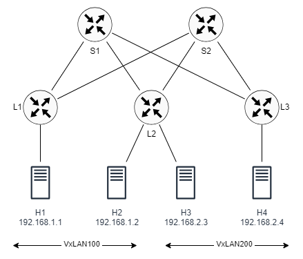

# VxLAN in a Spine-Leaf Data Centre

This lab extends a VxLAN over a spine-leaf topology consisting of two spine and three leaf routers. Four hosts are connected to the three leaf switches. The hosts belong to two VxLANs. The configuration allows each host to communicate with the others over L2 or L3, depending on the location of the destination host.



## Configuration overview:

The network topology is specified in the containerlab file vxlan-dc.clab.yaml. The file specifies the images needed for each node as well as any configuration files and startup commands.

To enable BGP on the routers, the daemons file used by FRR must include the following line:

```
bgpd=yes
```

The router configuration files are in the *-frr.conf files. The files include the interface and BGP configurations for each router. This lab shares many similarities with the EVPN lab; however, it differs in the BGP configuration.

BGP configuration is organized as follows. The underlay BGP configuration builds a typical spine-leaf topology using eBGP by organizing the routers into three Autonomous Systems (AS). The two spine routers belong to AS65000 while each leaf router is in a separate AS (AS65001 to AS65003). Each leaf router peers with both spine routers using unnumbered interfaces (which rely on IPv6). The underlay configuration is responsible for advertising the loopback interface address of the leaf routers, which are used as VTEP addresses. The overlay BGP connects all routers using iBGP (AS100). To avoid full-mesh peering, the spine routers are used as router reflectors. Each leaf router connects to both spine routers. This overlay is responsible of advertising the VNIs. The overlay and underlay configuration are achieved using peer groups within the default VRF.

The VxLAN configuration reside in the setup-vxlan.sh script file and it is similar to the one in the EVPN lab. The configuration also assigns a user-defined MAC address and an IPv4 address to the bridge. The user-defined MAC address is needed to easily identify the bridge address. The assigned IP address is used as default gateway for the hosts (see the topology file).

```
docker exec -it clab-dc-l1 ip link set br100 addr aa:bb:cc:00:00:01
docker exec -it clab-dc-l1 ip addr add 192.168.1.100/24 dev br100
```


## Starting and ending the lab

Use the following command to start the lab:

```
$ sudo clab deploy [-t vxlan-dc.clab.yaml]
```

Setup VxLAN:

```
$ sudo ./setup-vxlan.sh
```

To end the lab:

```
sudo clab destroy [-t vxlan-dc.clab.yaml]
```


## Verification

You should be able to ping from one host to any other host in the network. The hosts that reside on the same subnet will connect over VxLAN tunnel, while hosts residing in different subnet will connect over IP. You can verify the connectivity using ping and mtr.

 
