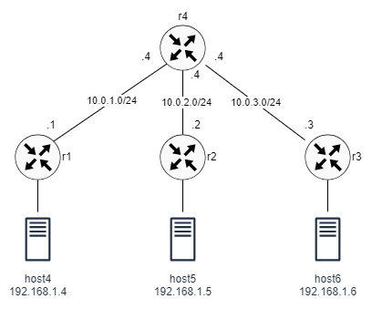

# VxLAN over BGP EVPN

This lab demonstrates the use of VxLAN to create an Ethernet tunnel connecting three LAN segments across a layer 3 network using BGP EVPN (Ethernet VPN) echnology. The network consists of four routers, three of the routers are VTEPs connecting to one server each. The fourth router acts as a route reflector for BGP routes.

To implement Layer 2 communication between hosts across the L3 network, the source and remote VTEPs must learn the MAC addresses of the hosts. The VTEPs function as BGP EVPN peers to exchange MAC/IP routes so that they can obtain the host MAC addresses.



## EVPN Overview

Traditional BGP-4 can manage only IPv4 unicast routing information, so MP-BGP was developed to support multiple network layer protocols. MP-BGP extends NLRI based on BGP-4. In MP-BGP, the description of the address family is added to NLRI to include other network layer protocols, such as the IPv6 unicast address family and VPN instance address family.

The VPN address family is a special multiprotocol BGP address family that has been added to BGP along with a new Network Layer Reachability Information (NLRI) format. Every VPNv4 prefix has the Route Distinguisher (RD) associated with it and the corresponding Multiprotocol Label Switching (MPLS) label, in addition to the normal BGP attributes.

EVPN NLRI defines several types of BGP EVPN routes, which can carry information for VxLANs such as the host IP address, MAC address, VNI, and VRF. After a VTEP learns the IP address and MAC address of a connected host, the VTEP can send the information to other VTEPs through MP-BGP routes. Therefore, learning of host IP address and MAC address information can be implemented on the control plane, negating the need for flooding on the data plane.

## Configuration overview:

The network topology is specified in the containerlab file vxlan-evpn.clab.yaml. The file specifies the images needed for each node as well as any configuration files and startup commands.

To enable BGP on the routers, the daemons file used by FRR must include the following line:

```
bgpd=yes
```

The router configuration files are in the *-frr.conf files. The files include the interface and BGP configurations for each router. Instead of establishing pairwise BGP peering among all routers, the VTEP routers establish BGP peering with a route reflector, r4. The BGP configuration is almost identical in all routers (the route reflector is slightly different) and it includes two address families. The IPv4 unicast family distributes the routes to all connected networks, including the loopback interfaces. The L2VPN EVPN address family distributes information about all learned VNIs (VxLAN Network Identifier).

The VxLAN configuration reside in the setup-vxlan.sh script file. The configuration is mostly similar to other labs with the exception of the following command, which specifies the multicast group address and the physical interface used as the endpoint for the VXLAN tunnel. Note that dynamic address learning is disabled so that populating the bridge entries is be done by BGP.

```
docker exec -it clab-evpn-r1 ip link add vxlan100 type vxlan id 100 dstport 4789 local 1.1.1.1 nolearning
```

## Starting and ending the lab

Use the following command to start the lab:

```
$ sudo clab deploy [-t vxlan-evpn.clab.yaml]
```

Setup VxLAN:

```
$ sudo ./setup-vxlan.sh
```

To end the lab:

```
sudo clab destroy [-t vxlan-evpn.clab.yaml]
```


## Verification

Verify that BGP is established between all routers (you may need tp wait a few minutes):

```
$ docker exec clab-evpn-r4 vtysh -c "show bgp summary"
```

```
IPv4 Unicast Summary (VRF default):
BGP router identifier 1.1.1.4, local AS number 100 vrf-id 0
BGP table version 8
RIB entries 15, using 1440 bytes of memory
Peers 3, using 39 KiB of memory
Peer groups 1, using 64 bytes of memory

Neighbor        V         AS   MsgRcvd   MsgSent   TblVer  InQ OutQ  Up/Down State/PfxRcd   PfxSnt Desc
*10.0.1.1       4        100        11        18        8    0    0 00:03:22            3        8 FRRouting/9.1_git
*10.0.2.2       4        100        11        18        8    0    0 00:03:21            3        8 FRRouting/9.1_git
*10.0.3.3       4        100        11        18        8    0    0 00:03:21            3        8 FRRouting/9.1_git

Total number of neighbors 3
* - dynamic neighbor
3 dynamic neighbor(s), limit 100

L2VPN EVPN Summary (VRF default):
BGP router identifier 1.1.1.4, local AS number 100 vrf-id 0
BGP table version 0
RIB entries 5, using 480 bytes of memory
Peers 3, using 39 KiB of memory
Peer groups 1, using 64 bytes of memory

Neighbor        V         AS   MsgRcvd   MsgSent   TblVer  InQ OutQ  Up/Down State/PfxRcd   PfxSnt Desc
*10.0.1.1       4        100        11        18        1    0    0 00:03:22            1        3 FRRouting/9.1_git
*10.0.2.2       4        100        11        18        1    0    0 00:03:21            1        3 FRRouting/9.1_git
*10.0.3.3       4        100        11        18        1    0    0 00:03:21            1        3 FRRouting/9.1_git

Total number of neighbors 3
* - dynamic neighbor
3 dynamic neighbor(s), limit 100
```

To verify BGP sessions:

```
$ docker exec clab-evpn-r4 vtysh -c "show bgp neighbor 10.0.1.1"
```

```
BGP neighbor is *10.0.1.1, remote AS 100, local AS 100, internal link
  Local Role: undefined
  Remote Role: undefined
Hostname: r1
 Member of peer-group fabric for session parameters
 Belongs to the subnet range group: 10.0.0.0/16
  BGP version 4, remote router ID 1.1.1.1, local router ID 1.1.1.4
  BGP state = Established, up for 00:05:13
  Last read 00:00:12, Last write 00:00:12
  Hold time is 180 seconds, keepalive interval is 60 seconds
  Configured hold time is 180 seconds, keepalive interval is 60 seconds
  Configured tcp-mss is 0, synced tcp-mss is 9448
  Configured conditional advertisements interval is 60 seconds
  Neighbor capabilities:
    4 Byte AS: advertised and received
    Extended Message: advertised and received
    AddPath:
      IPv4 Unicast: RX advertised and received
      L2VPN EVPN: RX advertised and received
    Long-lived Graceful Restart: advertised and received
      Address families by peer:
    Route refresh: advertised and received
    Enhanced Route Refresh: advertised and received
    Address Family IPv4 Unicast: advertised and received
    Address Family L2VPN EVPN: advertised and received
 ...
 For address family: IPv4 Unicast
  fabric peer-group member
  Update group 1, subgroup 1
  Packet Queue length 0
  Route-Reflector Client
  Community attribute sent to this neighbor(all)
  3 accepted prefixes

 For address family: L2VPN EVPN
  fabric peer-group member
  Update group 2, subgroup 2
  Packet Queue length 0
  Route-Reflector Client
  NEXT_HOP is propagated unchanged to this neighbor
  Community attribute sent to this neighbor(all)
  2 accepted prefixes

 ...
```


You should be able to ping from one host to the other:

```
$ docker exec -it clab-evpn-host4 ping 192.168.1.5
```


In another terminal, and while ping is ongoing, use tshark to look at the traffic at r4:

```
docker run -it --rm --net container:clab-evpn-r4 nicolaka/netshoot tshark -i eth1 -O vxlan
```

or if Tshark is installed on your host:

```
$ sudo ip netns exec clab-evpn-r4 tshark -i eth1 -O vxlan
```

You should see output similar to the following. Note the encapsulation of Ethernet frame inside a UDP packet coming from R1.

```
Frame 296: 148 bytes on wire (1184 bits), 148 bytes captured (1184 bits) on interface eth1, id 0
Ethernet II, Src: aa:c1:ab:90:60:5e (aa:c1:ab:90:60:5e), Dst: aa:c1:ab:6e:38:53 (aa:c1:ab:6e:38:53)
Internet Protocol Version 4, Src: 1.1.1.2, Dst: 1.1.1.1
User Datagram Protocol, Src Port: 44357, Dst Port: 4789
Virtual eXtensible Local Area Network
    Flags: 0x0800, VXLAN Network ID (VNI)
        0... .... .... .... = GBP Extension: Not defined
        .... .... .0.. .... = Don't Learn: False
        .... 1... .... .... = VXLAN Network ID (VNI): True
        .... .... .... 0... = Policy Applied: False
        .000 .000 0.00 .000 = Reserved(R): 0x0000
    Group Policy ID: 0
    VXLAN Network Identifier (VNI): 100
    Reserved: 0
Ethernet II, Src: aa:bb:05:05:05:05 (aa:bb:05:05:05:05), Dst: aa:bb:04:04:04:04 (aa:bb:04:04:04:04)
Internet Protocol Version 4, Src: 192.168.1.5, Dst: 192.168.1.4
Internet Control Message Protocol
```

On each VTEP, you can retrieve the information about configured VXLANs.

```
$ docker exec clab-evpn-r1 vtysh -c "show interface vxlan100"
```

```
Interface vxlan100 is up, line protocol is up
  Link ups:       1    last: 2024/05/09 11:43:11.32
  Link downs:     2    last: 2024/05/09 11:43:11.02
  vrf: default
  index 2 metric 0 mtu 1500 speed 0 txqlen 1000
  flags: <UP,BROADCAST,RUNNING,MULTICAST>
  Type: Ethernet
  HWaddr: f6:b8:41:6a:1e:e9
  inet6 fe80::f4b8:41ff:fe6a:1ee9/64
  Interface Type Vxlan
  Interface Slave Type Bridge
 VTEP IP: 1.1.1.1  VxLAN Id 100 Access VLAN Id 1

  Master interface: br100
  protodown: off
```

To retrieve information about the local MAC addresses and to show that type 2 routes are translated to an association between the remote MACs and the remote VTEPs:

```
$ docker exec clab-evpn-r1 vtysh -c "show evpn mac vni 100"
```

```
Number of MACs (local and remote) known for this VNI: 3
Flags: N=sync-neighs, I=local-inactive, P=peer-active, X=peer-proxy
MAC               Type   Flags Intf/Remote ES/VTEP            VLAN  Seq #'s
aa:bb:05:05:05:05 remote       1.1.1.2                              0/0
aa:bb:04:04:04:04 local        eth2                                 0/0
aa:bb:06:06:06:06 remote       1.1.1.3                              0/0
```

Each VTEP sends:

- one type 3 route for each local VNI, and
- one type 2 route for each local MAC address.

Use the route reflector:

```
$ docker exec clab-evpn-r4 vtysh -c "show bgp l2vpn evpn route"
```

```
BGP table version is 2, local router ID is 1.1.1.4
Status codes: s suppressed, d damped, h history, * valid, > best, i - internal
Origin codes: i - IGP, e - EGP, ? - incomplete
EVPN type-1 prefix: [1]:[EthTag]:[ESI]:[IPlen]:[VTEP-IP]:[Frag-id]
EVPN type-2 prefix: [2]:[EthTag]:[MAClen]:[MAC]:[IPlen]:[IP]
EVPN type-3 prefix: [3]:[EthTag]:[IPlen]:[OrigIP]
EVPN type-4 prefix: [4]:[ESI]:[IPlen]:[OrigIP]
EVPN type-5 prefix: [5]:[EthTag]:[IPlen]:[IP]

   Network          Next Hop            Metric LocPrf Weight Path
                    Extended Community
Route Distinguisher: 1.1.1.1:2
 *>i[2]:[0]:[48]:[aa:bb:04:04:04:04]
                    1.1.1.1                       100      0 i
                    RT:100:100 ET:8
 *>i[3]:[0]:[32]:[1.1.1.1]
                    1.1.1.1                       100      0 i
                    RT:100:100 ET:8
Route Distinguisher: 1.1.1.2:2
 *>i[2]:[0]:[48]:[aa:bb:05:05:05:05]
                    1.1.1.2                       100      0 i
                    RT:100:100 ET:8
 *>i[3]:[0]:[32]:[1.1.1.2]
                    1.1.1.2                       100      0 i
                    RT:100:100 ET:8
Route Distinguisher: 1.1.1.3:2
 *>i[2]:[0]:[48]:[aa:bb:06:06:06:06]
                    1.1.1.3                       100      0 i
                    RT:100:100 ET:8
 *>i[3]:[0]:[32]:[1.1.1.3]
                    1.1.1.3                       100      0 i
                    RT:100:100 ET:8

Displayed 6 prefixes (6 paths)
```

The VTEPs should receive similar information.

If the received routes are correctly translated, the type 3 routes are translated to an association between the remote VTEPs and the VNIs:

```
$ docker exec clab-evpn-r1 vtysh -c "show evpn vni"
```

```
VNI        Type VxLAN IF              # MACs   # ARPs   # Remote VTEPs  Tenant VRF
100        L2   vxlan100              3        0        2               default
```

To ensure the kernel has received information correctly:

```
$ docker exec clab-evpn-r1 bridge fdb show dev vxlan100 | grep dst
```

```
00:00:00:00:00:00 dst 1.1.1.2 self permanent
00:00:00:00:00:00 dst 1.1.1.3 self permanent
aa:bb:06:06:06:06 dst 1.1.1.3 self extern_learn
aa:bb:05:05:05:05 dst 1.1.1.2 self extern_learn
```
