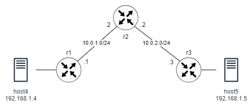

# VxLAN over BGP EVPN

This lab demonstrates the use of VxLAN to create an Ethernet tunnel connecting two LAN segments across a layer 3 network using BGP EVPN technology. The network consists of three routers, two of the routers are VTEPs connecting to one server. The third router acts as a route reflector for BGP routes.

To implement Layer 2 communication between hosts across the L3 network, the source and remote VTEPs must learn the MAC addresses of the hosts. The VTEPs function as BGP EVPN peers to exchange MAC/IP routes so that they can obtain the host MAC addresses.



## Starting and ending the lab

Use the following command to start the lab:

```
$ sudo clab deploy [-t vxlan-evpn.clab.yaml]
```

Setup VxLAN:

```
$ sudo ./setup-vxlan.sh
```

To end the lab:

```
sudo clab destroy [-t vxlan-evpn.clab.yaml]
```


## Verification

Verify that BGP is established between all routers (you may need tp wait a few minutes):

```
docker exec clab-evpn-r2 vtysh -c "show bgp summary"
```

```
L2VPN EVPN Summary (VRF default):
BGP router identifier 1.1.1.2, local AS number 100 vrf-id 0
BGP table version 0
RIB entries 3, using 552 bytes of memory
Peers 2, using 1432 KiB of memory
Peer groups 1, using 64 bytes of memory

Neighbor        V         AS   MsgRcvd   MsgSent   TblVer  InQ OutQ  Up/Down State/PfxRcd   PfxSnt Desc
*1.1.1.1        4        100        76        85        0    0    0 01:03:31            2        3 N/A
*1.1.1.3        4        100        77        85        0    0    0 01:03:28            1        3 N/A

Total number of neighbors 2
* - dynamic neighbor
2 dynamic neighbor(s), limit 100
```

To verify BGP sessions:

```
docker exec clab-evpn-r2 vtysh -c "show bgp neighbor 1.1.1.1"
```

```
BGP neighbor is *1.1.1.1, remote AS 100, local AS 100, internal link
Hostname: r1
 Member of peer-group fabric for session parameters
 Belongs to the subnet range group: 1.1.1.0/24
  BGP version 4, remote router ID 1.1.1.1, local router ID 1.1.1.2
  BGP state = Established, up for 01:05:06
  Last read 00:00:06, Last write 00:00:06
  Hold time is 180, keepalive interval is 60 seconds
  Neighbor capabilities:
    4 Byte AS: advertised and received
    Extended Message: advertised and received
    AddPath:
      L2VPN EVPN: RX advertised and received
    Route refresh: advertised and received(old & new)
    Enhanced Route Refresh: advertised and received
    Address Family L2VPN EVPN: advertised and received
    ...
 For address family: L2VPN EVPN
  fabric peer-group member
  Update group 1, subgroup 1
  Packet Queue length 0
  Route-Reflector Client
  NEXT_HOP is propagated unchanged to this neighbor
  Community attribute sent to this neighbor(all)
  2 accepted prefixes
  ...
```


You should be able to ping from one host to the other:

```
$ docker exec -it clab-evpn-host4 ping 192.168.1.5
```


In another terminal, and while ping is ongoing, use tshark to look at the traffic at R3:

```
docker run -it --rm --net container:clab-evpn-r3 nicolaka/netshoot tshark -i eth1 -O vxlan
```
or if Tshark is installed on your host:

```
$ sudo ip netns exec clab-evpn-r3 tshark -i eth1 -O vxlan
```

You should see output similar to the following. Note the encapsulation of Ethernet frame inside a UDP packet coming from R1.

```
Frame 25: 148 bytes on wire (1184 bits), 148 bytes captured (1184 bits) on interface eth1, id 0
Ethernet II, Src: aa:c1:ab:5e:99:ab (aa:c1:ab:5e:99:ab), Dst: aa:c1:ab:f7:54:de (aa:c1:ab:f7:54:de)
Internet Protocol Version 4, Src: 1.1.1.1, Dst: 1.1.1.3
User Datagram Protocol, Src Port: 43240, Dst Port: 4789
Virtual eXtensible Local Area Network
    Flags: 0x0800, VXLAN Network ID (VNI)
        0... .... .... .... = GBP Extension: Not defined
        .... 1... .... .... = VXLAN Network ID (VNI): True
        .... .... .0.. .... = Don't Learn: False
        .... .... .... 0... = Policy Applied: False
        .000 .000 0.00 .000 = Reserved(R): 0x0000
    Group Policy ID: 0
    VXLAN Network Identifier (VNI): 100
    Reserved: 0
Ethernet II, Src: aa:c1:ab:de:f0:ea (aa:c1:ab:de:f0:ea), Dst: aa:c1:ab:62:63:8b (aa:c1:ab:62:63:8b)
Internet Protocol Version 4, Src: 192.168.1.4, Dst: 192.168.1.5
Internet Control Message Protocol
```

On each VTEP (r1 and r3), you can retrieve the information about configured VXLANs.

```
docker exec clab-evpn-r1 vtysh -c "show interface vxlan100"
```

```
Interface vxlan100 is up, line protocol is up
  Link ups:       1    last: 2024/05/04 00:21:56.22
  Link downs:     2    last: 2024/05/04 00:21:55.75
  vrf: default
  index 2 metric 0 mtu 1500 speed 0
  flags: <UP,BROADCAST,RUNNING,MULTICAST>
  Type: Ethernet
  HWaddr: 76:42:6f:a2:d9:a4
  inet6 fe80::7442:6fff:fea2:d9a4/64
  Interface Type Vxlan
  Interface Slave Type Bridge
  VxLAN Id 100 VTEP IP: 1.1.1.1 Access VLAN Id 1

  Master interface: br100
  protodown: off
```

To retrieve information about the local MAC addresses and to show that type 2 routes are translated to an association between the remote MACs and the remote VTEPs:

```
$ docker exec clab-evpn-r1 vtysh -c "show evpn mac vni 100"
```

```
Number of MACs (local and remote) known for this VNI: 2
Flags: N=sync-neighs, I=local-inactive, P=peer-active, X=peer-proxy
MAC               Type   Flags Intf/Remote ES/VTEP            VLAN  Seq #'s
aa:c1:ab:de:f0:ea local        eth2                                 0/0
aa:c1:ab:62:63:8b remote       1.1.1.3                              0/0
```

Each VTEP sends:

- one type 3 route for each local VNI, and
- one type 2 route for each local MAC address.

Use the route reflector:

```
$ docker exec clab-evpn-r2 vtysh -c "show bgp l2vpn evpn route"
```

```
BGP table version is 8, local router ID is 1.1.1.2
Status codes: s suppressed, d damped, h history, * valid, > best, i - internal
Origin codes: i - IGP, e - EGP, ? - incomplete
EVPN type-1 prefix: [1]:[EthTag]:[ESI]:[IPlen]:[VTEP-IP]
EVPN type-2 prefix: [2]:[EthTag]:[MAClen]:[MAC]:[IPlen]:[IP]
EVPN type-3 prefix: [3]:[EthTag]:[IPlen]:[OrigIP]
EVPN type-4 prefix: [4]:[ESI]:[IPlen]:[OrigIP]
EVPN type-5 prefix: [5]:[EthTag]:[IPlen]:[IP]

   Network          Next Hop            Metric LocPrf Weight Path
                    Extended Community
Route Distinguisher: 1.1.1.1:2
*>i[2]:[0]:[48]:[aa:c1:ab:de:f0:ea]
                    1.1.1.1                       100      0 i
                    RT:100:100 ET:8
*>i[3]:[0]:[32]:[1.1.1.1]
                    1.1.1.1                       100      0 i
                    RT:100:100 ET:8
Route Distinguisher: 1.1.1.3:2
*>i[2]:[0]:[48]:[aa:c1:ab:62:63:8b]
                    1.1.1.3                       100      0 i
                    RT:100:100 ET:8
*>i[3]:[0]:[32]:[1.1.1.3]
                    1.1.1.3                       100      0 i
                    RT:100:100 ET:8

Displayed 4 prefixes (4 paths)
```

The VTEPs shoul receive similar information.


If the received routes are correctly translated, the type 3 routes are translated to an association between the remote VTEPs and the VNIs:

```
$ docker exec clab-evpn-r1 vtysh -c "show evpn vni"
```

```
VNI        Type VxLAN IF              # MACs   # ARPs   # Remote VTEPs  Tenant VRF
100        L2   vxlan100              2        0        1               default
```


To ensure the kernel has received information correctly:

```
$ docker exec clab-evpn-r1 bridge fdb show dev vxlan100 | grep dst
```

```
00:00:00:00:00:00 dst 1.1.1.3 self permanent
aa:c1:ab:62:63:8b dst 1.1.1.3 self extern_learn
```
