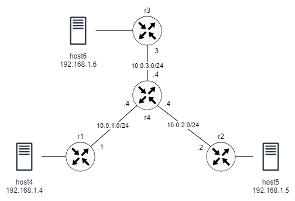

# VxLAN with Multicast

This lab demonstrates the use of VxLAN to link three hosts across a layer 3 network. The network consists of four routers. Three of the routers are connected to a single host each and acts as VxLAN VTEPs. The three routers are connected to a fourth router forming star topology. The routers rely on OSPF for routing. PIM and IGMP are used for VTEP discovery.  




## Configuration overview:

The network topology is specified in the containerlab file vxlan-pim.clab.yaml. The file specifies the images needed for each node as well as any configuration files and startup commands. 

To enable OSPF and PIM on the routers, the daemons file used by FRR must include the following lines:

```
ospfd=yes
pimd=yes
```

The router configuration files are in the *-frr.conf files. The files include the interface and OSPF configurations for each router. All router-facing interfaces belong to OSPF area 0. The OSPF distributes routes to all connected networks, including the loopback interfaces, which are used by the VxLAN.

Note that PIM must be enabled on all interfaces facing multicast sources or multicast receivers, as well as on the interface where the RP address is configured. IGMP is also enabled on the same interafces.

The VxLAN configuration reside in the setup-vxlan.sh script files. The configuration is mostly similar to other labs with the excption of the following command, which specifies the multicast group address and the physical interface used as the endpoint for the VXLAN tunnel. The TTL must be increased the default 1 to allow VxLAN packets to traverse the network.

```
docker exec -it clab-pim-r1 ip link add vxlan100 type vxlan id 100 dstport 4789 local 1.1.1.1 group 239.1.1.1 dev eth1 ttl 5
```


## Starting and ending the lab

Use the following command to start the lab:

```
$ cd ptp
$ sudo clab deploy [-t vxlan-pim.clab.yaml]
```

Setup VxLAN:

```
$ sudo ./setup-vxlan.sh
```

To end the lab:

```
$ sudo clab destroy [-t vxlan-pim.clab.yaml]
```

## Verification

You should be able to ping from one host to the other:

```
$ docker exec clab-pim-host4 ping 192.168.1.5
```

To check the bridge forwarding database:

```
$ docker exec clab-ptp-r1 bridge fdb show dev vxlan100 | grep dst
```

```
00:00:00:00:00:00 dst 239.1.1.1 via eth1 self permanent
aa:c1:ab:11:6a:e1 dst 1.1.1.3 self 
aa:bb:06:06:06:06 dst 1.1.1.3 self 
f6:36:7d:0f:82:8d dst 1.1.1.3 self 
aa:bb:05:05:05:05 dst 1.1.1.2 self 
```

Here are some PIM and IGMP verification commands:


```
$ docker exec clab-pim-r1 vtysh -c "show ip igmp interface"
```

```
Interface         State          Address  V  Querier          QuerierIp  Query Timer    Uptime
eth1                 up         10.0.1.1  3    local           10.0.1.1     00:01:03  00:05:44
lo                   up          1.1.1.1  3    local            1.1.1.1     00:01:03  00:05:44
```


```
$ docker exec clab-pim-r4 vtysh -c "show ip mroute"
```

```
IP Multicast Routing Table
Flags: S - Sparse, C - Connected, P - Pruned
       R - SGRpt Pruned, F - Register flag, T - SPT-bit set
 Source   Group      Flags  Proto  Input  Output  TTL  Uptime    
 *        239.1.1.1  SC     IGMP   lo     pimreg  1    00:18:27  
                            IGMP          eth1    1              
                            IGMP          eth2    1              
                            IGMP          eth3    1              
 1.1.1.1  239.1.1.1  ST     STAR   eth1   eth2    1    00:02:19  
                            STAR          eth3    1              
 1.1.1.2  239.1.1.1  ST     STAR   eth2   eth1    1    00:03:08  
                            STAR          eth3    1              
```                          

```
$ docker exec clab-pim-r1 vtysh -c "show ip mroute"
```

```
IP Multicast Routing Table
Flags: S - Sparse, C - Connected, P - Pruned
       R - SGRpt Pruned, F - Register flag, T - SPT-bit set
 Source   Group      Flags  Proto  Input  Output  TTL  Uptime    
 1.1.1.1  239.1.1.1  SFP    PIM    lo     pimreg  1    00:13:34  
```

To flush the bridge entries:

```
$ docker exec clab-pim-r1 bridge fdb flush dev br100
```

