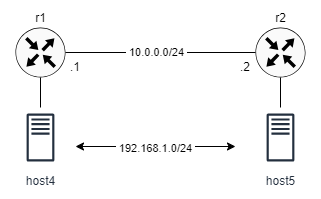

# VxLAN Point-to-point Tunnel

This lab demonstrates the use of VxLAN to create a point-to-point Ethernet tunnel connecting two LAN segments across a layer 3 network. The network consists of two routers, serving as VxLAN VTEP. Each router is connected to a single host. T




## Configuration overview

The network topology is specified in the containerlab file `vxlan-ptp.clab.yaml`. The file specifies the images needed for each node as well as any configuration files and startup commands. Consult [containerlab documentation](https://containerlab.dev/manual/topo-def-file/) for more information about the topology.

The router configuration files are in the *-frr.conf files. The configuration is minimal and it include defining the interfaces connecting the two routers and a static route.

The bulk of the configuration required to implement the tunnel reside on the Linux side. Here is a break down of the commands:

The following line creates a new virtual interface named `vxlan100` of type VXLAN (Virtual Extensible LAN) with an ID of 100. It specifies the destination port (4789), local IP address (10.0.0.1), and remote IP address (10.0.0.2) for communication.

```
ip link add vxlan100 type vxlan id 100 dstport 4789 local 10.0.0.1 remote 10.0.0.2`
```

The next lines add a new bridge interface named `br100`, then connect the `vxlan100` interface to it. The last disables Spanning Tree Protocol (STP) on the `br100` bridge, because it is not required. 

```
brctl addbr br100
brctl addif br100 vxlan100
brctl stp br100 off
```

The following lines bring the bridge interface `br100` and the VXLAN interface `vxlan100` up.

```
ip link set up dev br100
ip link set up dev vxlan100
```

Finally, this following line connects another interface, `eth2`, to the bridge `br100`. This interface connects the FRR router to the host.


```
brctl addif br100 eth2
```

Note that above commands need to be executed on each Frr router after initializing the containerlab topology. 

   
## Starting and ending the lab

Use the following command to start the lab:

```
$ cd ptp
$ sudo clab deploy [-t vxlan-ptp.clab.yaml]
```

Setup VxLAN:

```
$ sudo ./setup-vxlan.sh
```

To end the lab:

```
$ sudo clab destroy [-t vxlan-ptp.clab.yaml]
```


## Verification

You should be able to ping from one host to the other:

```
$ docker exec clab-ptp-host4 ping 192.168.1.5
```

```
PING 192.168.1.5 (192.168.1.5) 56(84) bytes of data.
64 bytes from 192.168.1.5: icmp_seq=1 ttl=64 time=0.092 ms
64 bytes from 192.168.1.5: icmp_seq=2 ttl=64 time=0.095 ms
64 bytes from 192.168.1.5: icmp_seq=3 ttl=64 time=0.259 ms
64 bytes from 192.168.1.5: icmp_seq=4 ttl=64 time=0.220 ms
...
```

To check the bridge forwarding database:

```
$ docker exec clab-ptp-r1 bridge fdb show dev vxlan100 | grep dst
```

```
00:00:00:00:00:00 dst 10.0.0.2 self permanent
2e:0d:9e:33:92:67 dst 10.0.0.2 self 
aa:bb:05:05:05:05 dst 10.0.0.2 self 
```

Check the VxLAN interface on teh routers:

```
$ docker exec clab-ptp-r1 vtysh -c "show int vxlan100"
```

```
Interface vxlan100 is up, line protocol is up
  Link ups:       1    last: 2024/05/07 14:44:37.01
  Link downs:     2    last: 2024/05/07 14:44:36.85
  vrf: default
  index 2 metric 0 mtu 1500 speed 4294967295 txqlen 1000
  flags: <UP,BROADCAST,RUNNING,MULTICAST>
  Type: Ethernet
  HWaddr: ee:9d:38:5f:35:14
  inet6 fe80::ec9d:38ff:fe5f:3514/64
  Interface Type Vxlan
  Interface Slave Type Bridge
 VTEP IP: 10.0.0.1  VxLAN Id 100 Access VLAN Id 1
  Mcast Group 10.0.0.2
  Master interface: br100
  protodown: off 
```

While running ping, use Tshark in another terminal to capture VxLAN packets (make sure Tshark is installed on your host machine):

```
$ sudo ip netns exec clab-ptp-r1 tshark -i eth1 -O vxlan
```

Notice the encapsulated ICMP packet inside the outer UDP packet.

```
Frame 53: 148 bytes on wire (1184 bits), 148 bytes captured (1184 bits) on interface eth1, id 0
Ethernet II, Src: aa:c1:ab:48:fe:ba (aa:c1:ab:48:fe:ba), Dst: aa:c1:ab:15:7c:25 (aa:c1:ab:15:7c:25)
Internet Protocol Version 4, Src: 10.0.0.1, Dst: 10.0.0.2
User Datagram Protocol, Src Port: 36705, Dst Port: 4789
Virtual eXtensible Local Area Network
    Flags: 0x0800, VXLAN Network ID (VNI)
        0... .... .... .... = GBP Extension: Not defined
        .... 1... .... .... = VXLAN Network ID (VNI): True
        .... .... .0.. .... = Don't Learn: False
        .... .... .... 0... = Policy Applied: False
        .000 .000 0.00 .000 = Reserved(R): 0x0000
    Group Policy ID: 0
    VXLAN Network Identifier (VNI): 100
    Reserved: 0
Ethernet II, Src: aa:bb:04:04:04:04 (aa:bb:04:04:04:04), Dst: aa:bb:05:05:05:05 (aa:bb:05:05:05:05)
Internet Protocol Version 4, Src: 192.168.1.4, Dst: 192.168.1.5
Internet Control Message Protocol
```


## Suggestions

Add one or more routers between r1 and r2 and configure a routing protocol (e.g. OSPF) among the routers. Make sure that the VxLAN interface in the `setup-vxlan.sh` has correct local and remote IP addresses.
