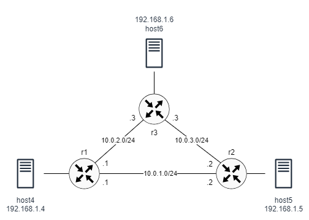

# VxLAN over L3 Network

This lab builds a network of three routers, serving as VxLAN VTEPs. The routers form a ring topology. Each router is connected to a single host. The routers rely on OSPF for routing.



VTEP discovery is done using three strategies:

- BUM flooding with address learning: All remote VTEPs are associated with the all-zero address. A BUM frame will be replicated to all destinations. The VXLAN device will still learn remote addresses automatically using source-address learning.

- Static MAC entries: If the MAC addresses of VTEPs are known, it is possible to pre-populate the FDB and disable learning. The all-zero entries are still needed for broadcast and multicast traffic (e.g. ARP and IPv6 neighbor discovery). Also, if a MAC is missing, the frame will always be sent using the all-zero entries.

- Static IP entries: The local VTEP can answer ARP requests on behalf of the remote nodes MAC-IP address association is known.

## Configuration overview

The network topology is specified in the containerlab file `vxlan-ring.clab.yaml`. The file specifies the images needed for each node as well as any configuration files and startup commands. Consult [containerlab documentation](https://containerlab.dev/manual/topo-def-file/) for more information about the topology.

The router configuration files are in the *-frr.conf files. The files include the interface and OSPF configurations for each router. All router-facing interfaces belong to OSPF area 0. The OSPF distributes routes to all connected networks, including the loop-back interfaces, which are used by the VxLAN.

The VxLAN configuration reside in the `setup-vxlan-*.sh` script files. Each file executes a slightly different set of commands to configure a Linux bridge and a VxLAN interface in each router, depending on the VTEP discovery strategy.

**BUM flooding and address learning:**

The following command creates an interface named vxlan100 of type VXLAN with an ID of 100. It sets the destination port for the VxLAN to 4789 and the local IP address to 1.1.1.1.

```
ip link add vxlan100 type vxlan id 100 dstport 4789 local 1.1.1.1
```

The following commands create a bridge and link it to the VxLAN interface as well as an Ethernet interface to connect the host.

```
brctl addbr br100
brctl addif br100 vxlan100
brctl stp br100 off
ip link set up dev br100
ip link set up dev vxlan100
brctl addif br100 eth2
```

The following commands append two entries to the FDB of the bridge associated with the vxlan100 interface in router r1. The all-zero address entries indicate that all addresses should be forwarded to the destinations 1.1.1.2 and 1.1.1.4, which are the other two routers (VTEPs). This effectively send all BUM addresses to all VTEPs.

```
bridge fdb append 00:00:00:00:00:00 dev vxlan100 dst 1.1.1.2
bridge fdb append 00:00:00:00:00:00 dev vxlan100 dst 1.1.1.3
```

In this strategy, the bridge will use source-address learning to populate its forwarding database (FDB) with unicast addresses. Multicast and broadcast packets will be forwarded to all VTEPs as before.

```
bridge fdb append 00:00:00:00:00:00 dev vxlan100 dst 1.1.1.2
bridge fdb append 00:00:00:00:00:00 dev vxlan100 dst 1.1.1.3
bridge fdb append aa:bb:05:05:05:05 dev vxlan100 dst 1.1.1.2
bridge fdb append aa:bb:06:06:06:06 dev vxlan100 dst 1.1.1.3
```


**Static MAC entries:**

In this strategy, the known MAC addresses of the remote VTEPs are entered manually to the FDB and dynamic address learning is disabled in the VxLAN interface. This strategy works well if L3 addresses are not needed.

```
ip link add vxlan100 type vxlan id 100 dstport 4789 local 1.1.1.1 nolearning
```

The following commands populate the FDB with the addresses of the remote hosts

```
bridge fdb append 00:00:00:00:00:00 dev vxlan100 dst 1.1.1.2
bridge fdb append 00:00:00:00:00:00 dev vxlan100 dst 1.1.1.3
bridge fdb append aa:bb:05:05:05:05 dev vxlan100 dst 1.1.1.2
bridge fdb append aa:bb:06:06:06:06 dev vxlan100 dst 1.1.1.3
```

**Static IP entries:**

In the previous two strategies, ARP requests must travel all the way to the destination and we needed all-zero entries to handle ARP requests. If the VTEP is used as ARP proxy, it can answer to ARP requests on behalf of the remote hosts. In this case the all-zero entries are not needed in most cases:

```
ip link add vxlan100 type vxlan id 100 dstport 4789 local 1.1.1.1 nolearning
```

The following commands populate the FDB with the addresses of the remote hosts

```
bridge fdb append aa:bb:05:05:05:05 dev vxlan100 dst 1.1.1.2
bridge fdb append aa:bb:06:06:06:06 dev vxlan100 dst 1.1.1.3
```

And the following commands add two entries to the ARP table of `vxlan100` interface to map the IP addresses of the remote hosts to their MAC addresses.

```
ip neigh add 192.168.1.5 lladdr aa:bb:05:05:05:05 dev vxlan100
ip neigh add 192.168.1.6 lladdr aa:bb:06:06:06:06 dev vxlan100
```

We could optionally add default entries to handle unexpected addresses:

```
bridge fdb append 00:00:00:00:00:00 dev vxlan100 dst 1.1.1.2
bridge fdb append 00:00:00:00:00:00 dev vxlan100 dst 1.1.1.3
```

## Starting and ending the lab

Use the following command to start the lab:

```
$ cd ptp
$ sudo clab deploy [-t vxlan-ring.clab.yaml]
```

Setup VxLAN:

- For BUM flooding strategy:

  ```
  $ sudo ./setup-vxlan-flood.sh
  ```

- For static MAC entries:

  ```
  $ sudo ./setup-vxlan-l2.sh
  ```

- For static IP entries:

  ```
  $ sudo ./setup-vxlan-l3.sh
  ```

To end the lab:

```
$ sudo clab destroy [-t vxlan-ring.clab.yaml]
```

## Verification

You should be able to ping from one host to the other:

```
$ docker exec -it clab-ring-host4 ping 192.168.1.5
```

To check the bridge forwarding database:

```
$ docker exec clab-ptp-r1 bridge fdb show dev vxlan100 | grep dst
```

```
00:00:00:00:00:00 dst 1.1.1.2 self permanent
00:00:00:00:00:00 dst 1.1.1.3 self permanent
aa:c1:ab:d4:91:6e dst 1.1.1.3 self
aa:bb:06:06:06:06 dst 1.1.1.3 self
fa:84:3d:1c:89:dc dst 1.1.1.3 self
aa:bb:05:05:05:05 dst 1.1.1.2 self
```
